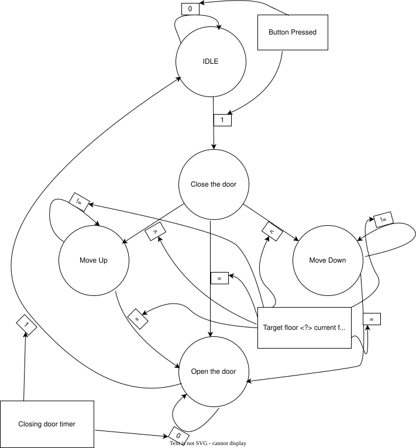
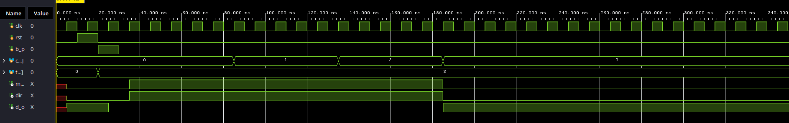
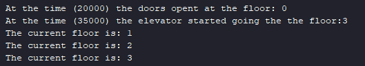
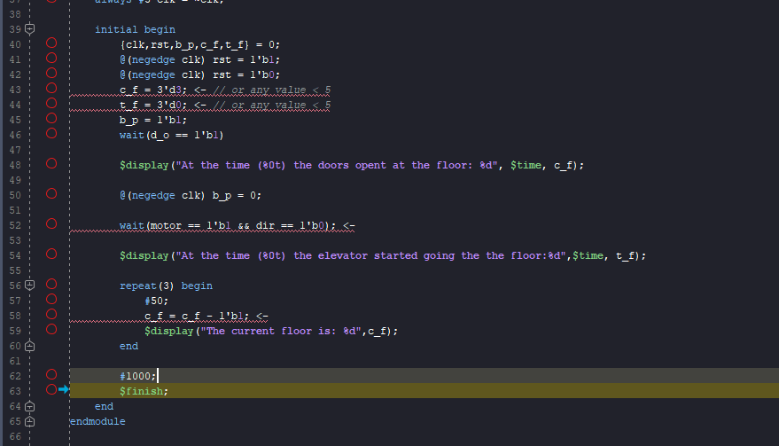
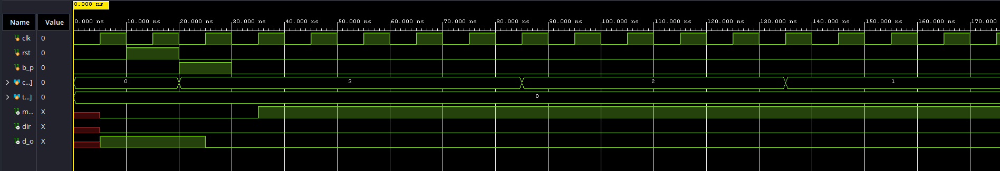
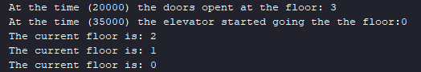

# Creating an Elevator Control System using FSM - Verilog

## Project Overview ##
This project features a digital control system for an elevator, implemented using a Finite State Machine (FSM) designed in Verilog. Beyond the physical hardware description, the project includes a dedicated testbench environment to simulate real-world physical transitions, such as floor movement, motor direction control, and door timers.

## Features ##

### Verilog Design
* Built using a Moore FSM architecture.
* Features 5 distinct logical states: `IDLE`, `CLOSE_DOOR`, `MOVE_UP`, `MOVE_DOWN`, and `OPEN_DOOR`.
* Includes an internal timer for door control: a 32-bit counter of 500,000,000 clock cycles, i.e. 5 seconds at a 100 MHz (10 ns) clock.
* Models a building with 5 floors (`0`–`4`); floors are 3-bit inputs coming from the cabin's position sensors.

### Directed Testbench
* Instantiates the FSM and provides specific stimuli (button presses, target floors).
* Automatically simulates the physical movement of the cabin between floors using time delays.
* Generates real-time logs in the console to track the elevator's behavior.
* It is a directed, non-self-checking testbench: correctness is judged by reading the console log and the waveform. This was my first project, before learning SystemVerilog verification; the later projects ([RAM](https://github.com/DanielCazacu25/Class-Based-RAM-Testbench-SV), [ALU](https://github.com/DanielCazacu25/UVM_based_ALU_testbench), [FIFO](https://github.com/DanielCazacu25/UVM_Based_Async_FIFO_Testbench), [AXI4-Lite](https://github.com/DanielCazacu25/UVM_Based_AXI4_Lite_Testbench)) move to constrained-random stimulus with automatic checking.

## FSM (Finite State Machine) Architecture ##
The logic of the controller is visually represented in the state diagram below. The FSM transitions between states based on internal timers, user input (button presses), and floor comparisons.

* **IDLE (000):** The elevator is stationary with doors open. It waits for a user request (`button_pressed`).
* **CLOSE_DOOR (001):** The doors close. The FSM compares the `current_floor` with the `target_floor` to determine the direction of travel.
* **MOVE_UP (010):** The motor turns on, and direction is set to UP. The state is maintained until the current floor matches the target.
* **MOVE_DOWN (011):** The motor turns on, and direction is set to DOWN. The state is maintained until the target is reached.
* **OPEN_DOOR (100):** The destination is reached. The motor stops, the doors open, and an internal counter keeps the doors open for roughly 5 seconds before returning to the `IDLE` state.

## Project Structure ##

| Folder/File | Description |
| :---------- | :---------- |
| `Design/` | Contains the main hardware circuit module (`Elevator.v`). |
| `Testbench/` | Contains the simulation testbench (`Elevator_tb.v`). |
| `images/` | Contains the FSM state diagram (`fsm_diagram.svg`). |
| `guide_images/` | Contains the screenshot of the testbench lines to edit for the Moving-Down case. |
| `results/` | Contains screenshots of the waveforms and Tcl Console for both scenarios. |

## How to Run:

* ### Vivado Simulation:
1. Open Vivado Xilinx and create a new project.
2. Add `Elevator.v` as a design source and `Elevator_tb.v` as a simulation source.
3. **Note on Simulation Time:** the testbench ends itself with `$finish` about 1.2 µs after start, once the cabin has reached the target floor and the doors have opened. Run it with `run -all` in the Tcl console. The 5-second door timer (500,000,000 cycles) is therefore **not** observed to expire, and the return from `OPEN_DOOR` to `IDLE` is not shown in simulation; raising Vivado's runtime does not change this, since `$finish` stops the run first. See Known limitations for how this would be made testable.

* ### Results:
By clicking **Run Simulation** in Vivado, the testbench will automatically execute the scenario. 
The physical floor transitions and door status will be displayed directly in the Tcl Console via `$display` tasks, alongside the detailed signal interactions in the Waveform viewer.

* ### Final notes:
* Ensure that your clock period in the testbench matches the physical constraints you want to simulate.
* If you want to test different floor combinations (Ex: Moving down), you will need to change the following lines of code in the testbench:
* Line 43 -> change c_f to the value you want (0–4).
* Line 44 -> change t_f to the value you want (0–4).
* If you want to test the Moving-Down case, you will also need to change the following lines:
* Line 52 -> dir == 1'b1 change to dir == 1'b0.
* Line 58 -> c_f = c_f + 1'b1 change to c_f - 1'b1.

## Known limitations ##

Documented rather than fixed, so the repository stays a record of where the portfolio started.

* **The door timer is not testable in simulation.** The 5-second wait is a hardcoded 500,000,000-cycle count, so simulating it would take hundreds of millions of cycles. The standard fix is a module parameter (e.g. `DOOR_CYCLES`, default 500,000,000 for synthesis) that the testbench overrides with a small value at instantiation, so the full `OPEN_DOOR` → `IDLE` cycle becomes visible in a few hundred nanoseconds without changing the hardware.
* **The testbench does not check anything automatically.** Its first `wait(d_o == 1'b1)` passes immediately, because the doors are already open in `IDLE`, so the "doors open" message does not mark an observed transition. Results are verified by reading the log and the waveform.
* **Single request, no queue.** `button_pressed` is only considered in `IDLE`; requests made while the cabin is moving are ignored.
* **Target changes during travel are not handled.** If `target_floor` changes while moving and ends up behind the cabin, `current_floor == target_floor` is never reached and the FSM stays in `MOVE_UP`/`MOVE_DOWN`.
* **The 5-floor limit is an assumption, not a check.** Floors are 3-bit inputs, so `5`–`7` are representable and accepted by the design; only the stimulus keeps them in range.
* **`CLOSE_DOOR` lasts a single clock cycle,** with no door-closed sensor.